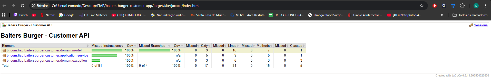
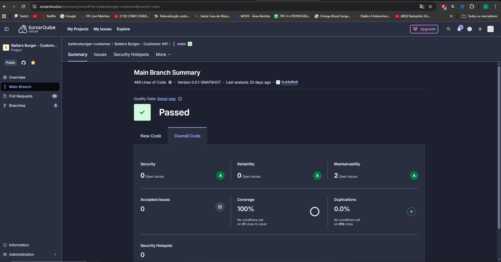

# Baiters Burger - Customer API

Este projeto é uma API de microsserviço desenvolvida em Java, focada na gestão de clientes (Customers) para o ecossistema **Baiters Burger**. A aplicação utiliza uma arquitetura baseada em portas e adaptadores (Hexagonal) para garantir a separação de conceitos, facilidade de manutenção e testabilidade.

## 🚀 Tecnologias e Ferramentas

* **Linguagem:** Java 25.
* **Framework:** Spring Boot 3.5.7.
* **Base de Dados:** MySQL 8.0.
* **Persistência:** Spring Data JPA / Hibernate.
* **Mapeamento:** MapStruct 1.6.3.
* **Infraestrutura:** Terraform (AWS ECS Fargate).
* **CI/CD:** GitHub Actions.
* **Qualidade:** SonarCloud e Jacoco.

## 🏗️ Arquitetura do Sistema

A aplicação segue os princípios da **Arquitetura Hexagonal**:

* **Domain:** Contém os modelos de negócio (`Customer`) e as exceções de domínio.
* **Application (Use Cases):** Define as interfaces de entrada (`InsertCustomerUseCase`, `GetCustomerByCpfUserCase`) e os serviços que implementam a lógica de negócio (`CustomerService`).
* **Infrastructure:** Contém os adaptadores externos:
    * **Web:** Controladores REST (`CustomerController`), DTOs e mapeadores.
    * **Persistence:** Adaptadores de repositório, entidades JPA e repositórios Spring Data.
    * **Configuration:** Configuração de Beans e perfis do Spring.

## 🛠️ Como Executar o Projeto

### Pré-requisitos
* Docker e Docker Compose.
* JDK 25.
* Maven 3.9+ (ou utilizar o wrapper incluído).

### Execução Local (Docker Compose)
Para subir a base de dados MySQL configurada:
```bash
docker-compose up -d
```

## 🌐 Endpoints Principais

A API segue os padrões REST e está disponível através do prefixo `/api/v1/customers`. Abaixo estão os endpoints detalhados:

### 1. Clientes (Customers)

| Método | Endpoint | Descrição |
| :--- | :--- | :--- |
| **POST** | `/api/v1/customers` | Regista um novo cliente no sistema. |
| **GET** | `/api/v1/customers/{cpf}` | Procura e retorna os dados de um cliente através do CPF. |

---

### 2. Detalhes das Operações

#### **Criar Cliente**
* **URL:** `/api/v1/customers`
* **Corpo da Requisição (JSON):**
    ```json
    {
      "name": "Nome do Cliente",
      "cpf": "12345678900",
      "email": "cliente@email.com"
    }
    ```
* **Validações:**
* O nome deve conter apenas letras e espaços.
* O CPF não pode ser nulo ou vazio.
* O e-mail deve ser um formato válido.
* **Resposta de Sucesso:** `201 Created`.

#### **Get by CPF**
* **URL:** `/api/v1/customers/{cpf}`
* **Resposta de Sucesso:** `200 OK` com os dados do cliente.
* **Erros Possíveis:** * `404 Not Found`: Caso o CPF não esteja registado no sistema.

---

## Tratamento de Erros (Global)
A API utiliza um manipulador de exceções global para retornar respostas padronizadas em caso de erro:
* **CustomerAlreadyExistsException:** Retorna `400 Bad Request` se tentar registar um CPF já existente.
* **InvalidCpfException:** Retorna `400 Bad Request` para CPFs em formato inválido ou vazios.
* **CustomerNotFoundException:** Retorna `404 Not Found` quando a busca não obtém resultados.

---

## 🧪 Testes e Qualidade

O projeto adota uma estratégia rigorosa de testes e análise estática para garantir a estabilidade do domínio e a confiabilidade das regras de negócio.

#### Ferramentas de Teste
* **JUnit 5:** Framework principal para execução de testes unitários.
* **Mockito:** Utilizado para criação de mocks e stubbing de dependências (como o repositório) nos testes de serviço.
* **AssertJ/JUnit Assertions:** Para verificações fluídas de resultados e exceções.

#### Cobertura de Código (Jacoco)
A aplicação utiliza o **Jacoco** para medir a cobertura de testes. Existem regras automáticas configuradas no `pom.xml` que validam a qualidade do código durante a fase de verificação:
* **Mínimo de Cobertura:** 70% de instruções cobertas.
* **Pacotes Monitorados:** Foco principal nas camadas de `application` (casos de uso) e `domain` (modelos e regras).
* **Exclusões:** Classes de infraestrutura, configurações, mapeadores e a classe principal da aplicação são excluídas do relatório de cobertura para focar na lógica de negócio.



#### Análise Estática (SonarCloud)
O projeto está integrado ao **SonarCloud** para análise de "Code Smells", vulnerabilidades e bugs técnicos.
* **Project Key:** `baitersburger-customer`.
* **Frequência:** A análise é disparada automaticamente em cada Pull Request ou Push para a branch principal através do GitHub Actions.



#### Como Executar os Testes

Para executar todos os testes unitários e gerar o relatório de cobertura localmente:

```bash
# Executa os testes utilizando o perfil de CI (H2 em memória)
./mvnw clean test -Dspring.profiles.active=ci
```
Para executar a verificação completa (testes + check de cobertura do Jacoco):
```bash
./mvnw verify -Dspring.profiles.active=ci
```
---

## ☁️ Infraestrutura e Deploy (CI/CD)

A aplicação utiliza uma esteira de automação completa para garantir que o código seja testado, empacotado e implantado de forma consistente na nuvem AWS.

#### Infraestrutura como Código (IaC)
A infraestrutura é gerenciada via **Terraform**, permitindo a criação de um ambiente escalável e isolado.
* **AWS ECS Fargate:** A aplicação roda como um serviço de containers sem servidor, eliminando a necessidade de gerenciar instâncias EC2.
* **Rede e Segurança:** Configuração automática de VPC, subnets públicas e Security Groups que permitem tráfego apenas na porta da aplicação (8080).
* **Logs e Monitoramento:** Integração nativa com o **Amazon CloudWatch** para retenção de logs por 7 dias.
* **Gestão de Segredos:** Utilização do **AWS Secrets Manager** para recuperar credenciais de banco de dados (username/password) de forma segura em tempo de execução.

#### Fluxo de CI/CD (GitHub Actions)
O pipeline está definido no arquivo `pipeline.yml` e é acionado em cada `push` para a branch `main` ou `pull_request` para `develop`.

#### **Etapa 1: Testes e Qualidade (CI)**
* Execução de testes unitários com Maven e perfil `ci`.
* Análise estática de segurança e qualidade via **SonarCloud**.

#### **Etapa 2: Build do Artefato**
* Compilação do projeto com JDK 25.
* Geração do arquivo JAR e upload como artefato do workflow.

#### **Etapa 3: Entrega de Container (CD - Docker)**
* Criação automática do repositório no **Amazon ECR**, caso não exista.
* Build da imagem Docker baseada no `eclipse-temurin:25-jre`.
* Push da imagem tagueada com o SHA do commit para o ECR.

#### **Etapa 4: Deploy de Infraestrutura (CD - Terraform)**
* Inicialização e aplicação dos planos do Terraform.
* Atualização da **Task Definition** do ECS com a nova URI da imagem.
* Deploy controlado do serviço no cluster, garantindo estabilidade antes de finalizar a substituição das tarefas antigas.